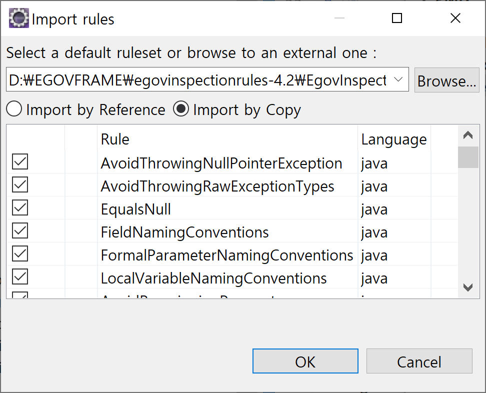

# 공통컴포넌트 컨트리뷰션 해보기!

- 2024년 전자정부 표준프레임워크 컨트리뷰션 세미나
- 2차 08.22.목 19:00~20:30
- 공통컴포넌트 컨트리뷰션 해보기!
  - 시큐어코딩 Exception 제거

목차
- [시큐어코딩 Exception 제거하는 이유](#시큐어코딩-exception-제거하는-이유)
- [30. 로그인정책관리 시큐어코딩 Exception 제거](#30-로그인정책관리-시큐어코딩-exception-제거)
- [30. 로그인정책관리 시큐어코딩 PMD 진단/조치](#30-로그인정책관리-시큐어코딩-pmd-진단조치)

## 시큐어코딩 Exception 제거하는 이유

시큐어코딩 Exception 제거하는 이유
- `throws Exception/catch (Exception` 부적절한 예외 처리
- 광범위한 예외 처리 대신 구체적인 예외 처리를 수행한다.

### 1. 소프트웨어 개발 보안 가이드
- 소프트웨어_개발보안_가이드(2021.12.29).pdf
- https://www.kisa.or.kr/2060204/form?postSeq=5&page=1
- 39페이지
  - `4. 구현단계 기준과의 관계`

구분|설계단계|구현단계
-|-|-
에러 처리(1개)|예외처리|오류 메시지 정보노출

- 40페이지
  - 부적절한 예외 처리

- 294페이지
  - `3. 부적절한 예외 처리`

```
나. 보안대책
값을 반환하는 모든 함수의 결과값을 검사하여, 그 값이 의도했던 값인지 검사하고, 예외 처리를
사용하는 경우에 광범위한 예외 처리 대신 구체적인 예외 처리를 수행한다.
```

---

### 2. 소프트웨어 보안약점 진단가이드
- 소프트웨어_보안약점_진단가이드(2021).pdf
- https://www.kisa.or.kr/2060204/form?postSeq=9&page=1

- 429페이지
  - 제4장 구현단계 보안약점 진단
  - `3. 부적절한 예외 처리`

- 431페이지

```
라. 진단방법

함수 또는 메소드에 대하여 반환값을 검사하고 예외를 발생시키는 경우(①) 구체적인 예외처리를
수행하는지 확인한다.
```
---

이클립스 환경설정
```
save
```


## 30. 로그인정책관리 시큐어코딩 Exception 제거

크롬 링크 주소 복사
```
http://localhost:8080/egovframework-all-in-one/uat/uap/selectLoginPolicyList.do
```

이클립스 Search
```
/uat/uap/selectLoginPolicyList.do
```

소스트리 브랜치 생성
```
2024/pmd/EgovLoginPolicyController
```

이클립스 Find/Replace
```java
throws Exception
```

개정이력 추가
```
 *   2024.08.22  이백행          시큐어코딩 Exception 제거
```

Exception Handling
- https://www.egovframe.go.kr/wiki/doku.php?id=egovframework:rte2:bsl:exception_handling

```java
throw processException("result.nodata.msg"); 
```

```java
throw processException("fail.common.msg", e); 
```

## 30. 로그인정책관리 시큐어코딩 PMD 진단/조치

[전자정부 표준프레임워크 표준 Inspection 룰셋 적용하기](https://www.egovframe.go.kr/wiki/doku.php?id=egovframework:dev4.2:imp:inspection#%EC%A0%84%EC%9E%90%EC%A0%95%EB%B6%80_%ED%91%9C%EC%A4%80%ED%94%84%EB%A0%88%EC%9E%84%EC%9B%8C%ED%81%AC_%ED%91%9C%EC%A4%80_inspection_%EB%A3%B0%EC%85%8B_%EC%A0%81%EC%9A%A9%ED%95%98%EA%B8%B0)
- 표준 Inspection 룰셋 한글/영문판의 압축파일 : 개발환경 4.2 이상 버전 사용
- egovinspectionrules-4.2.zip

PMD > Import rules > Import by Copy


LoginPolicyVO

번호|PMD 룰|설명|SW 보안 약점
-|-|-|-
2|ArrayIsStoredDirectly|배열객체 참조 외부 노출|Public 메소드부터 반환된 Private 배열
27|MethodReturnsInternalArray|클래스내 내부배열을 직접 반환하는 메소드|Private 배열에 Public 데이터 할당

MethodReturnsInternalArray
- 'delYn'을 반환하면 내부 배열이 노출될 수 있음
```java
	public String[] getDelYn() {
		if (delYn != null) {
			return Arrays.stream(delYn).toArray(String[]::new);
		}
		return null;
	}
```

OnlyOneReturn
- 단 한 번의 반품
- A method should have only one exit point, and that should be the last statement in the method
- 메소드에는 종료 지점이 하나만 있어야 하며, 종료 지점은 메소드의 마지막 명령문이어야 합니다.
- https://docs.pmd-code.org/pmd-doc-7.0.0-rc3/pmd_rules_java_codestyle.html#onlyonereturn

ReturnEmptyCollectionRatherThanNull
- Null이 아닌 빈 컬렉션 반환
- Return an empty collection rather than null.
- null이 아닌 빈 컬렉션을 반환합니다.
- https://docs.pmd-code.org/pmd-doc-7.0.0-rc3/pmd_rules_java_errorprone.html#returnemptycollectionratherthannull

MethodArgumentCouldBeFinal
- 메서드 인수가 최종일 수 있음
- Parameter 'delYn' is not assigned and could be declared final
- 매개변수 'delYn'이 할당되지 않았으며 최종으로 선언될 수 있습니다.
- https://docs.pmd-code.org/pmd-doc-7.0.0-rc3/pmd_rules_java_codestyle.html#methodargumentcouldbefinal

UseVarargs
- Vararg 사용
- Consider using varargs for methods or constructors which take an array the last parameter.
- 배열을 마지막 매개변수로 사용하는 메서드나 생성자에는 가변인수 사용을 고려하세요.
- https://docs.pmd-code.org/pmd-doc-7.0.0-rc3/pmd_rules_java_bestpractices.html#usevarargs

```java
	public String[] getDelYn() {
		String[] delYn = null;
		if (this.delYn != null) {
			delYn = Arrays.stream(this.delYn).toArray(String[]::new);
		}
		return delYn;
	}
```

ArrayIsStoredDirectly
- 배열 'delYn' 이 직접 저장되어 있음
```java
	public void setDelYn(String[] delYn) {
		if (delYn != null) {
			this.delYn = Arrays.stream(delYn).toArray(String[]::new);
		}
	}
```

```java
	public void setDelYn(final String... delYn) {
		if (delYn != null) {
			this.delYn = Arrays.stream(delYn).toArray(String[]::new);
		}
	}
```

List

```java
	public List<LoginPolicyVO> getLoginPolicyList() {
		List<LoginPolicyVO> loginPolicyList = null;
		if (this.loginPolicyList != null) {
			loginPolicyList = new ArrayList<>(this.loginPolicyList);
		}
		return loginPolicyList;
	}
```

```java
	public void setLoginPolicyList(final List<LoginPolicyVO> loginPolicyList) {
		if (loginPolicyList != null) {
			this.loginPolicyList = new ArrayList<>(loginPolicyList);
		}
	}
```
