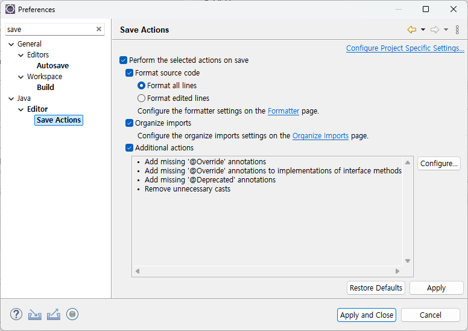

# 시큐어코딩 Exception 제거 함께해요!

- [10. 로그인 시큐어코딩 Exception 제거](#10-로그인-시큐어코딩-exception-제거)
- [10. 로그인 셀레늄 단위 테스트](#10-로그인-셀레늄-단위-테스트)
- [일반 로그인을 처리한다 DAO 단위 테스트](#일반-로그인을-처리한다-dao-단위-테스트)
- [10. 로그인 시큐어코딩 PMD 진단/조치](#10-로그인-시큐어코딩-pmd-진단조치)

환경설정
```
save
```


## 10. 로그인 시큐어코딩 Exception 제거
크롬
```
http://localhost:8080/egovframework-all-in-one/uat/uia/egovLoginUsr.do
```

Search
```
"/uat/uia/egovLoginUsr.do
```

새 브랜치
```
2024/pmd/EgovLoginController
```

바꾸기
```java
throws Exception
```

```java
@exception Exception
```

catch
```java
throw new BaseRuntimeException(e);
```

## 10. 로그인 셀레늄 단위 테스트

새 브랜치
```
2024/selenium/EgovLoginController/loginUsrView
```

Install a Selenium library
- Selenium 라이브러리 설치
- https://www.selenium.dev/documentation/webdriver/getting_started/install_library/
- https://mvnrepository.com/artifact/org.seleniumhq.selenium/selenium-java/4.22.0

```xml
<!-- https://mvnrepository.com/artifact/org.seleniumhq.selenium/selenium-java -->
<dependency>
    <groupId>org.seleniumhq.selenium</groupId>
    <artifactId>selenium-java</artifactId>
    <version>4.22.0</version>
    <scope>test</scope>
</dependency>
```

Selenium 코드 구성 및 실행
- Organizing and Executing Selenium Code
- Examples
- https://www.selenium.dev/documentation/webdriver/getting_started/using_selenium/

```
TestEgovLoginControllerSelenium
```

## 일반 로그인을 처리한다 DAO 단위 테스트

새 브랜치
```
2024/test/LoginDAO/actionLogin
```

참고
```
DeptJobDAOTest
```

```
ActionLoginLoginDAOTest
```

## 10. 로그인 시큐어코딩 PMD 진단/조치

[전자정부 표준프레임워크 표준 Inspection 룰셋 적용하기](https://www.egovframe.go.kr/wiki/doku.php?id=egovframework:dev4.2:imp:inspection#%EC%A0%84%EC%9E%90%EC%A0%95%EB%B6%80_%ED%91%9C%EC%A4%80%ED%94%84%EB%A0%88%EC%9E%84%EC%9B%8C%ED%81%AC_%ED%91%9C%EC%A4%80_inspection_%EB%A3%B0%EC%85%8B_%EC%A0%81%EC%9A%A9%ED%95%98%EA%B8%B0)
- 표준 Inspection 룰셋 한글/영문판의 압축파일 : 개발환경 4.2 이상 버전 사용
- egovinspectionrules-4.2.zip

커밋
- https://github.com/GSITM2023/egovframe-common-components-2024/commits/2024/pmd/EgovLoginController/
