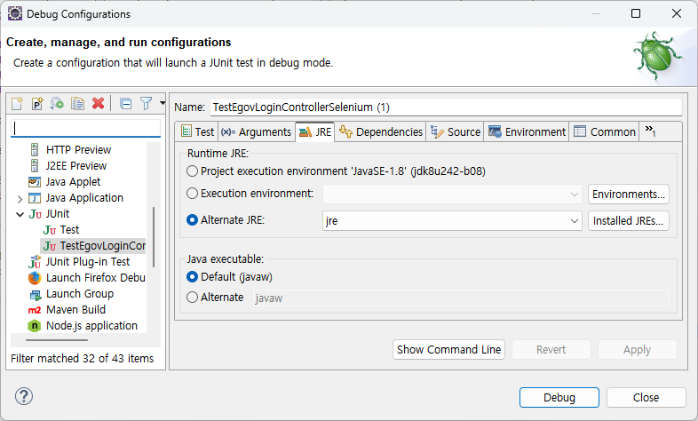

# 시큐어코딩 Exception 제거 함께해요!

- [10. 로그인 시큐어코딩 Exception 제거](#10-로그인-시큐어코딩-exception-제거)
- [10. 로그인 셀레늄 단위 테스트](#10-로그인-셀레늄-단위-테스트)
- [일반 로그인을 처리한다 DAO 단위 테스트](#일반-로그인을-처리한다-dao-단위-테스트)
- [10. 로그인 시큐어코딩 PMD 진단/조치](#10-로그인-시큐어코딩-pmd-진단조치)

환경설정
```
save
```


## 10. 로그인 시큐어코딩 Exception 제거
크롬
```
http://localhost:8080/egovframework-all-in-one/uat/uia/egovLoginUsr.do
```

Search
```
"/uat/uia/egovLoginUsr.do
```

새 브랜치
```
2024/pmd/EgovLoginController
```

바꾸기
```java
throws Exception
```

```java
@exception Exception
```

catch
```java
throw new BaseRuntimeException(e);
```

개정이력 추가
```
 *   2024.07.25  이백행          시큐어코딩 Exception 제거
```

수정할 소스
```
EgovLoginController
EgovLoginService
EgovLoginServiceImpl
EgovClntInfo 개정이력 <pre> 추가, 위치 이동
EgovCmmUseService
EgovCmmUseServiceImpl 개정이력 <pre> 추가
CmmUseDAO 개정이력 <pre> 추가
LoginDAO
EgovFileScrty 개정이력 <pre> 추가, 위 주석 제거
EgovSndngMailRegistService
EgovSndngMailRegistServiceImpl
EgovFileMngService 개정이력 <pre> 추가
EgovFileMngServiceImpl 개정이력 <pre> 추가
FileManageDAO 개정이력 <pre> 추가
SndngMailRegistDAO
EgovSndngMailService
EgovSndngMailServiceImpl
EgovMultiPartEmail
EgovXMLDoc 개정이력 <pre> 추가, 위치 이동
egovMailMsgIdGnrService
EgovFileScrty
```

커밋
- https://github.com/GSITM2023/egovframe-common-components-2024/commits/2024/pmd/EgovLoginController/
- https://github.com/GSITM2023/egovframe-common-components-2024/commits/2024/pmd/EgovLoginController2/
- https://github.com/GSITM2023/egovframe-common-components-2024/commits/2024/pmd/EgovLoginController3/

## 10. 로그인 셀레늄 단위 테스트

새 브랜치
```
2024/selenium/EgovLoginController/loginUsrView
```

Install a Selenium library
- Selenium 라이브러리 설치
- https://www.selenium.dev/documentation/webdriver/getting_started/install_library/
- https://mvnrepository.com/artifact/org.seleniumhq.selenium/selenium-java/4.23.0

```xml
<!-- https://mvnrepository.com/artifact/org.seleniumhq.selenium/selenium-java -->
<dependency>
    <groupId>org.seleniumhq.selenium</groupId>
    <artifactId>selenium-java</artifactId>
    <version>4.23.0</version>
	<scope>test</scope>
</dependency>
```

Selenium 코드 구성 및 실행
- Organizing and Executing Selenium Code
- Examples
- https://www.selenium.dev/documentation/webdriver/getting_started/using_selenium/

```
TestLoginUsrViewEgovLoginControllerSelenium
```

Junit Test 실행 에러
- java.lang.UnsupportedClassVersionError: org/openqa/selenium/WebDriver has been compiled by a more recent version of the Java Runtime (class file version 55.0), this version of the Java Runtime only recognizes class file versions up to 52.0
- java.lang.UnsupportedClassVersionError: org/openqa/selenium/WebDriver는 최신 버전의 Java Runtime(클래스 파일 버전 55.0)으로 컴파일되었습니다. 이 버전의 Java Runtime은 최대 52.0의 클래스 파일 버전만 인식합니다.



로그인 화면 이동
```java
driver.get("http://localhost:8080/egovframework-all-in-one/uat/uia/egovLoginUsr.do");
```

새로고침
```java
JavascriptExecutor executor = (JavascriptExecutor) driver;

executor.executeScript("location.reload();");
```

업무 탭 클릭
```java
WebElement typeUsr = driver.findElement(By.id("typeUsr"));
typeUsr.click();
```

아이디 입력
```java
WebElement id = driver.findElement(By.id("id"));
id.sendKeys("TEST1");
```

비밀번호 입력
```java
WebElement password = driver.findElement(By.id("password"));
password.sendKeys("rhdxhd12");
```

로그인 버튼 클릭
```java
executor.executeScript("actionLogin();");
```

확인
```
WebElement a = driver.findElement(By.tagName("a"));
String aString = a.getText();
assertEquals("", "로그아웃", aString);
```

커밋
- https://github.com/GSITM2023/egovframe-common-components-2024/commits/2024/selenium/EgovLoginController/loginUsrView/
- https://github.com/GSITM2023/egovframe-common-components-2024/commits/2024/selenium/EgovLoginController/loginUsrView2/
- https://github.com/GSITM2023/egovframe-common-components-2024/commits/2024/selenium/EgovLoginController/loginUsrView3/

## 일반 로그인을 처리한다 DAO 단위 테스트

새 브랜치
```
2024/test/LoginDAO/actionLogin
```

참고
```
DeptJobDAOTest
```

```
ActionLoginLoginDAOTest
```

커밋
- https://github.com/GSITM2023/egovframe-common-components-2024/commits/2024/test/LoginDAO/actionLogin/
- https://github.com/GSITM2023/egovframe-common-components-2024/commits/2024/test/LoginDAO/actionLogin2/
- https://github.com/GSITM2023/egovframe-common-components-2024/commits/2024/test/LoginDAO/actionLogin3/

## 10. 로그인 시큐어코딩 PMD 진단/조치

새 브랜치
```
2024/pmd/EgovLoginController
```

[전자정부 표준프레임워크 표준 Inspection 룰셋 적용하기](https://www.egovframe.go.kr/wiki/doku.php?id=egovframework:dev4.2:imp:inspection#%EC%A0%84%EC%9E%90%EC%A0%95%EB%B6%80_%ED%91%9C%EC%A4%80%ED%94%84%EB%A0%88%EC%9E%84%EC%9B%8C%ED%81%AC_%ED%91%9C%EC%A4%80_inspection_%EB%A3%B0%EC%85%8B_%EC%A0%81%EC%9A%A9%ED%95%98%EA%B8%B0)
- 표준 Inspection 룰셋 한글/영문판의 압축파일 : 개발환경 4.2 이상 버전 사용
- egovinspectionrules-4.2.zip
