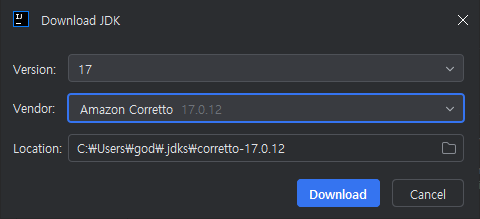
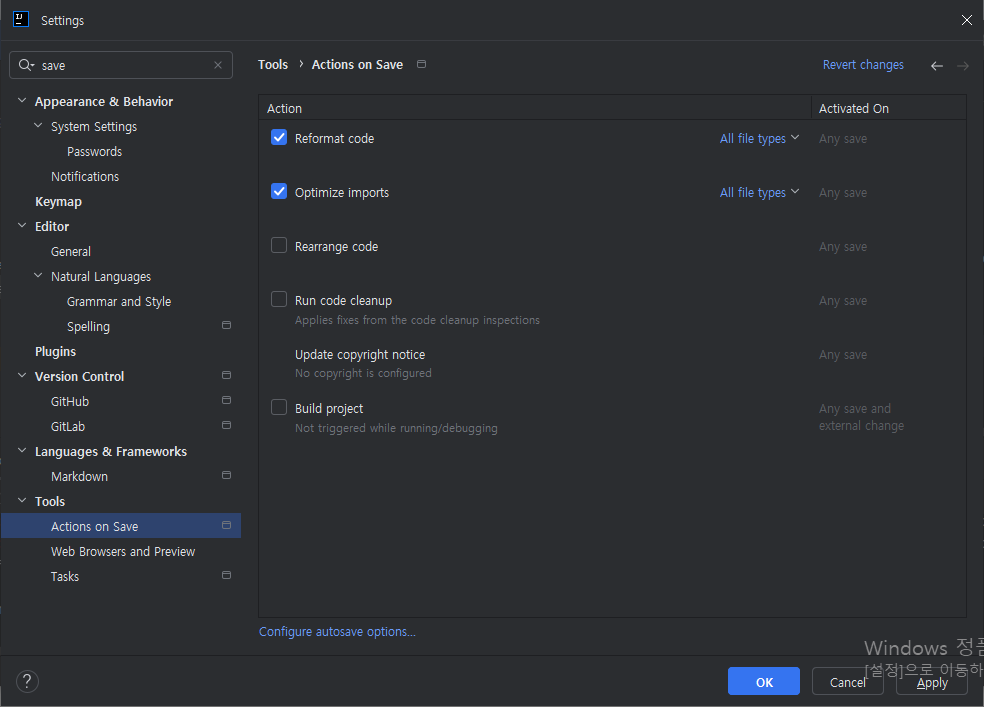

# CURD 프로그램 자동 생성

CRUD 프로그램 자동 생성 기능

데이터베이스 테이블을 참조하여 실행 가능한 CRUD Java Code 및 Jsp, SqlMapConfig 파일, SqlMap 파일 자동 생성.

템플릿 기반 Code Gen
- https://www.egovframe.go.kr/wiki/doku.php?id=egovframework:dev2:imp:codegen:template

## 목차

- [IntelliJ 다운로드](#1-intellij-로-spring-boot-332-시작하기)
- [Spring Data JPA 3.3.3](#spring-data-jpa-333)

## 1. IntelliJ 로 Spring Boot 3.3.2 시작하기

2024년 8월 13일 화요일

1.1. IntelliJ 다운로드
```
https://www.jetbrains.com/ko-kr/idea/download/?section=windows
```

IntelliJ IDEA Community Edition
- ideaIC-2024.2.exe

IntelliJ IDEA Ultimate
- ideaIU-2024.2.exe

1.2. 스프링 초기화

Spring Initializr
- https://start.spring.io/

종속성 추가...Ctrl + b
- Add dependencies...Ctrl + b

```
web
```

생성Ctrl + ⏎
- GenerateCtrl + ⏎

1.3. demo.zip 압축 풀기

1.4. 프로젝트 열기

```
A problem occurred configuring root project 'demo'.
> Could not resolve all artifacts for configuration ':classpath'.
   > Could not resolve org.springframework.boot:spring-boot-gradle-plugin:3.3.2.
     Required by:
         project : > org.springframework.boot:org.springframework.boot.gradle.plugin:3.3.2
      > Dependency requires at least JVM runtime version 17. This build uses a Java 8 JVM.

* Try:
> Run this build using a Java 17 or newer JVM.
> Run with --stacktrace option to get the stack trace.
> Run with --info or --debug option to get more log output.
> Run with --scan to get full insights.
> Get more help at https://help.gradle.org.
```

Run this build using a Java 17 or newer JVM.
- Java 17 이상 JVM을 사용하여 이 빌드를 실행하세요.

그래들 Java 17

Settings > Build, Execution, Deployment > Build Tools > Gradle
- Gradle JVM: Amazon Crretto 17
- Download JDK...

  - C:\Users\god\.jdks\corretto-17.0.12
- Download 버튼 클릭
- OK 버튼 클릭
- Reload All Gradle Projects 버튼 클릭

Project JDK is not defined

1.5 크롬 확인

http://localhost:8080/

1.6 helloworld
```
@SpringBootApplication
@RestController
public class DemoApplication {

    @GetMapping("/helloworld")
    public String hello() {
        return"Hello World!";
    }
}
```
http://localhost:8080/helloworld

1.7 Tools > Actions on Save


## Spring Data JPA 3.3.3

스프링 초기화(Spring Initializr)

https://start.spring.io/

종속성 추가...Ctrl + b(Add dependencies...Ctrl + b)

Web, Security, JPA, Actuator, Devtools...
```
web
```

```
security
```

```
jpa
```

```
actuator
```

```
devtools
```

JDBC
```
h2
```

```
mariadb
```

```
postgresql
```

Developer Tools
```
lombok
```

---

시작하기(Getting Started)

https://spring.io/projects/spring-data-jpa

https://docs.spring.io/spring-data/jpa/reference/jpa/getting-started.html

---

스프링 시큐리티 로그인

http://localhost:8080/login

Username
```
user
```

Password
```
ed2ae9e7-58c9-4a5b-9cc7-f408041053c0
```
Using generated security password: ed2ae9e7-58c9-4a5b-9cc7-f408041053c0

---

H2 console 로그인

H2 console available at '/h2-console'. Database available at 'jdbc:h2:mem:ab647d1b-5861-4efd-be17-e3e8b5d497f1'

http://localhost:8080/h2-console

- Driver Class: org.h2.Driver
- JDBC URL: jdbc:h2:~/test
```
jdbc:h2:mem:ab647d1b-5861-4efd-be17-e3e8b5d497f1
```
- User Name: sa
- Password:

spring security h2 console 403

https://docs.spring.io/spring-security/reference/servlet/authentication/passwords/index.html

```java
.requestMatchers(new AntPathRequestMatcher("/h2-console/**")).permitAll()
```

```java
package com.example.demo;

import org.springframework.context.annotation.Bean;
import org.springframework.context.annotation.Configuration;
import org.springframework.security.config.Customizer;
import org.springframework.security.config.annotation.web.builders.HttpSecurity;
import org.springframework.security.config.annotation.web.configuration.EnableWebSecurity;
import org.springframework.security.web.SecurityFilterChain;
import org.springframework.security.web.util.matcher.AntPathRequestMatcher;

@Configuration
@EnableWebSecurity
public class SecurityConfig {

    @Bean
    public SecurityFilterChain securityFilterChain(HttpSecurity http) throws Exception {
        http
                .authorizeHttpRequests(
                        (authorize) -> authorize
//                                .requestMatchers(new AntPathRequestMatcher("/h2-console/**")).permitAll()
//                                .anyRequest().permitAll()
                                .requestMatchers("/").permitAll()
                                .requestMatchers("/login").permitAll()
//                                .requestMatchers("/h2-console/**").permitAll()
                                .requestMatchers(new AntPathRequestMatcher("/h2-console/**")).permitAll()
                                .anyRequest().authenticated()
                )
                .httpBasic(Customizer.withDefaults())
                .formLogin(Customizer.withDefaults());


        return http.build();
    }

}
```

application.properties
```properties
spring.application.name=demo

logging.level.com.example.demo=DEBUG

spring.datasource.url=jdbc:h2:mem:testdb
spring.datasource.driverClassName=org.h2.Driver
spring.datasource.username=sa
spring.datasource.password=
spring.jpa.database-platform=org.hibernate.dialect.H2Dialect
```
